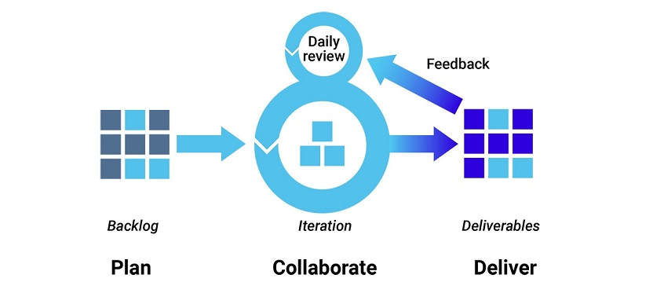
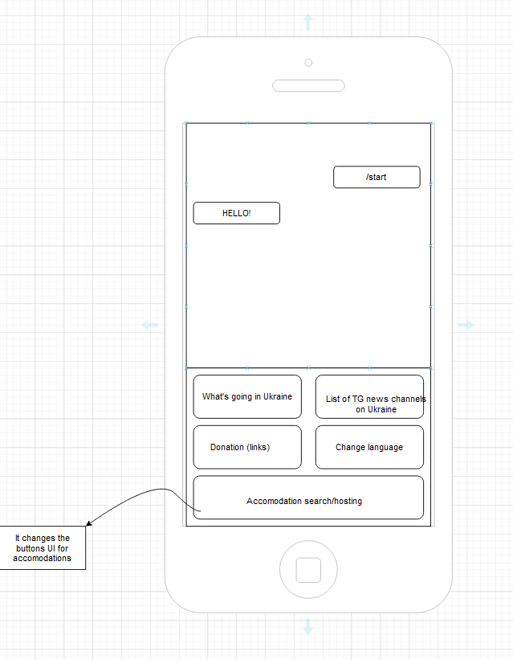

# Project Vision Document
**Project name:** Uhelp  
**Authors:** Maksym Dmyterko, Danila Prymak, Volha Andrava  
**Date:** 19.03.22  

**1. Executive summary (max. 150 words)**  

All over the world we have  heard about what’s happening in Ukraine currently. In our engineering project we present the Telegram bot with the main goal to highlight the ways to aid Ukrainian government, find or provide the accommodation for those who are in the need, and the references to trustworthy resources for further update on thew current news.

The problem detected is lack of software that would help Ukrainians that are migrating find any sort of help they can get and connect them with people that are willing to help all over the world using Telegram bot(for example find places to stay, connect them to people who are willing to host them, find places with humanitarian help provided etc.).    
Target group is people in Ukraine who are forced to migrate from Ukraine because of war and needs help and people from all over the world who are ready to help them by any chance and travelers who is searching for accommodation to stay for free(see 2, Disclaimer)  

Risks: Some of the functionalities will become outdated because of fast change of war situation in Ukraine.

Benefits: providing Ukrainian refugee with help of any kind and providing people from Poland with opportunity to help them, more than one language support, huge accommodation searching system 

**2. Purpose and target audience (min. 150 words)**  

The aim of the project is to create a telegram bot that will connect refugees from Ukraine who need help with people from all over the world who can offer help through our telegram bot. Moreover, it will provide up-to-date relevant information about the war and its details. 

 

The main reason for the target group to use our app is that the hosts/host seekers connection will be better than competing products have (as we saw the most refugees can get while searching accommodation for now is just contact details of the host, they need to contact him/her themselves), meanwhile our app will provide database of available accommodations to the refuges with integrated google services for help (like google maps route to the place etc.).  

 

Secondly, benefit of using our app is that all information about the war will be as accurate and up-to-date (the number of approved and checked by research mass media will be chosen as a source of information) as possible due to the administrator who moderates the content and checks if sources are still trustworthy. 

 

Important to say that at first glance, choosing Telegram which is founded by Russians for our purpose shouldn’t be a first-choice option, but Telegram right now plays a very important role in providing information about war as digital mass media due to its lack of censorship of information. People from both Russia and Ukraine (and all over the world if use TG) can get not censored information about war. President of Ukraine Volodymyr Zelenskyy uses telegram as one the main source of communication with the Ukrainians ([channel in TG](https://t.me/V_Zelenskiy_official)): from rallying global support to disseminating air raid warnings and maps of local bomb shelters. All in all, Telegram seems to be a nice platform for implementation of our app. 

(Opinion is based on these sources: [Why Ukrainians turned to Telegram app as Russia invaded, How Telegram Became the Digital Battlefield in the Russia-Ukraine War, Telegram is the app of choice in the war in Ukraine despite experts' privacy concerns](https://www.npr.org/2022/03/14/1086483703/telegram-ukraine-war-russia?t=1650114416921)

 

 The added values which our project will bring to the target groups are providing a new service and saving time. We want to create this software to collect all the necessary information and functionality in one place and provide fast and easy access to this information and functionality. 

The people our bot is aimed at are Ukrainians and residents of other countries who are interested in news or want to offer help to refugees. 

 

*Disclaimer*: 

The one big problem our app can face in the future is being not up to date because of war ends. The solution is to use our accommodation searching system to as a platform for travelers to provide accommodation for each other (couchsurfing - like way) in the form of telegram bot 

**3. Market (at least 3 competing products)**

@SpVIRI_nochivlya_bot(Своїм по вірі НОЧІВЛЯ):

\+ info about amount of accommodations around the countries 

\- only Ukrainian languages supported 

\- only accommodation database supported 

\- no connection between host and host seeker supported( host seeker needs to contact host 		himself/herself 

 

@Hotovyi_do_vsioho_bot  (Готовий до всього): 

\+ big informational database(from plan of action during the war till contacts of all people        

connected with evacuation) 

\+ big action functionallity to help Ukraine( humanitarian help, donation to the army, 		volunteering etc.) 

\- no English support(only Ukrainian) 

@dytyna_ne_sama_bot (ДИТИНА НЕ САМА): 

\+ a bit of English support(tab “For foreigners” 

\- lack of action and informational functionality 

 
**4. Product description (at least 3 modules / epics)**

Module of accommodation searching 
- Hosts 

- Host seekers 

Module of informational portal 

- General information about the current state of the war 

- Links to donation platforms 

- List of telegram channels with news on Ukraine 

Module of contact to the admin 

Module of changing the language 

- English 

- Ukrainian 

- Polish 

Module of integration 

- Integration with Google services: Google maps, translator 

Chosen methodology of software development – [AGILE](https://www.synopsys.com/blogs/software-security/top-4-software-development-methodologies/)

We will use GitHub to distribute the software, Teams and Notion to introduce Agile mothodology 

3 types of users: 

- Administrator – solving system problems and constraints of the bot 

- User searching for information 

- Refugee or traveler searching for accommodation 

- Supporter or traveler ready to provide accommodation 

**5. Scope and Limitations**  
*Maksym Dmyterko* – backend(JAVA), testing; 

*Danila Prymak* – testing, backend(JAVA); 

*Volha Andrava* – testing, documentation, backend(JAVA); 

*Preferable technologies*: main backend framework is JAVA, Spring Boot, for other frameworks(as Database or integrations for the bot) there is no strong preferences. Cloud platform for the deployment – Heroku

**6. Design**

### Schedule for the 1st SEMESTR   

|Date       | Description|  
| :------   |  ------ |  
| 31.03.22  | Finishing project vision document  |  
| 30.04.22  | Project requirements delivery |  
| 15.05.22  |Module of informational portal  |  
| 15.06.22  |Module of accommodation searching(at least 50% must be done)  |  
| 15.06.22  |Working prototype that suits the requirements |  

### Schedule for the 2nd SEMESTR   

|Date       | Description|  
| :------   |  ------ |  
| 22.11.22  | Module of integration with Google services  |  
| 22.11.22  | Deploying app on the server/testing  |  
| 23.01.23  | Delivery of documentation to the comitee  |
| 12.2022-01.2023  | Finished application|

If your team has significant limitations (e.g. limits to architecture, devices supporting design, availability, performance, etc.) then these limitations should also be described in this section. 

 

Limits: limitations on UI design because of the Telegram environment 

Architecture: we will use open-source relational database management system emphasizing extensibility and SQL compliance as PostgreSQL 

Availability: on every device that supports Telegram(Android,IOS, Desktop, web) 

Performance: we mostly manipulate text, thus, our app must be fast 

---
## Resources used to create this markdown file

- https://www.markdownguide.org/cheat-sheet/
- https://www.markdownguide.org/extended-syntax/#tables
- https://agea.github.io/tutorial.md/\
- https://markdownlivepreview.com/
